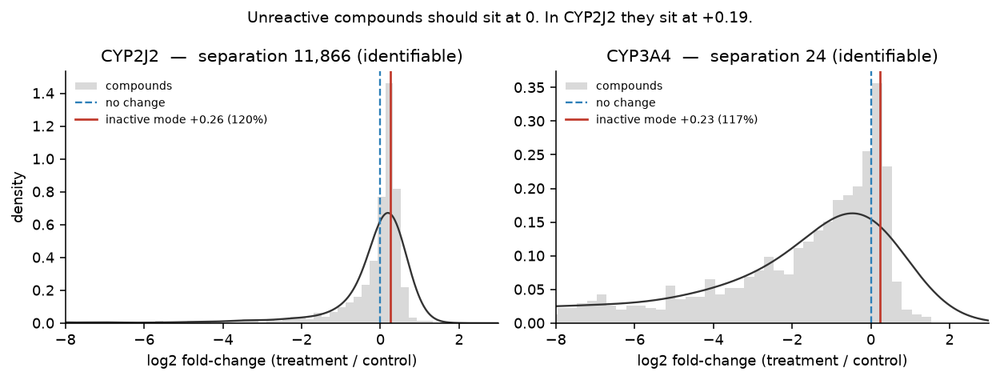
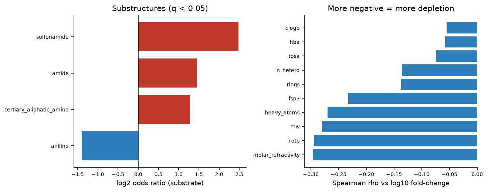

# CYP3A4 / CYP2J2 reactivity analysis

Analysis of the OpenADMET / Octant Echo-MS CYP reactivity screen: identifying substrates with
statistical rationale, extracting chemical insight for CYP3A4, and selecting 1,000 purchasable
compounds for follow-up.

**Data**: [OpenADMET Octant CYP release](https://huggingface.co/datasets/openadmet/Octant_CYP_inhibition_reactivity_blog_release)
(CC-BY-4.0) · [assay write-up](https://openadmet.github.io/Octant_CYP_blog_post/)

```bash
conda env create -f environment.yml && conda activate cyp-reactivity
make test        # 18 unit tests over the statistical layer
make all         # reproduces every CSV and figure from data/raw/
```

---

## Summary of what the data required

Four properties of this dataset drove every methodological choice. All were verified against the
released files rather than assumed, and each is reproduced by code in this repo.

**1. The released summary discards the information needed to call a substrate.**
`reactivity.tsv` reduces each compound to `pct_remaining = 100 · mean(treatment)/mean(control)` —
a ratio of means with no standard error, no interval, no p-value. (`log2fc` and `log10fc` are the
same quantity rescaled: `log2fc = 3.3219 · log10fc` exactly.) A fixed ">50% depleted" rule is
therefore an *effect-size* rule with no inferential content: it treats a compound with an 8%
coefficient of variation and one with a 30% CV identically. All analysis here works from the
well-level file instead.

**2. Complete depletion is recorded as zero, and zeros are not missing data.**
All 848 zero-area wells are on the treatment side; no control well is zero, and `mass_error_ppm`
is `NaN` in exactly the rows where `area == 0`. These are non-detects — the parent compound was
metabolised below the detection limit. 148 compound×enzyme pairs have *every* treatment replicate
censored and a further 107 are partially censored. Taking logs drops or corrupts precisely the
**most reactive compounds in the screen**, so they are modelled as left-censored observations.

**3. Unreactive compounds do not sit at 100% remaining.**
62.5% of CYP2J2 compounds appear *enriched* by incubation, which is not biologically possible —
an enzyme cannot create parent compound. The inactive population sits at **+0.2 log2 (≈115% of
control)** on all eight plates. Control and treatment wells are also spatially segregated —
controls occupy only rows A–D of the 32×48 plate, treatments rows E–AF — so the comparison is not
position-matched and a plate-level gradient maps straight onto every fold-change. The offset is
estimated from the inactive mode and corrected.

**4. n = 4 is enough to find substrates and not enough to certify non-substrates.**
Median control CV is 8%, so the assay is tight, but the minimum detectable effect at 95% power is
still ~30% depletion for CYP3A4. Equivalence testing at a ±20% margin certifies almost nothing.
Results are therefore reported in **three classes**, not two.

---

## Part 1 — Substrate identification

### Method

| Step | Choice | Why |
|---|---|---|
| Contrast | Tobit (left-censored normal) MLE on `log10(area)` | Non-detects are information, not absence of it |
| Variance | Empirical-Bayes moderation, Smyth (2004) | n=4 gives a useless per-compound variance; borrow across ~1,200 compounds |
| Normalisation | Per-plate inactive-mode offset | Unreactive compounds must sit at zero |
| Multiplicity | Benjamini–Hochberg within enzyme | ~1,200 simultaneous tests |
| Decision | Two one-sided tests against a ±20% effect boundary | Certifies *both* directions, not just hits |

Compounds are partitioned by where the confidence interval falls relative to the effect boundary:
CI entirely below → **substrate**; entirely above → **non-substrate**; straddling → **inconclusive**.
The third class is not hedging. "Not a hit" conflates *confidently unreactive* with *never
adequately measured*, and Part 3 needs the first as negatives while excluding the second.

Fully-censored compounds carry a **bounded** estimate: the treatment mean is pinned at the LOD,
the largest value consistent with the observations, making the reported depletion a floor rather
than a point estimate. With control means above 2,800 against an LOD of 21, those bounds already
imply >99% depletion.

### Results

| Enzyme | Substrate | Non-substrate | Inconclusive |
|---|---|---|---|
| **CYP3A4** | 884 (72.3%) | 125 (10.2%) | 214 (17.5%) |
| **CYP2J2** | 292 (23.9%) | 601 (49.1%) | 330 (27.0%) |

→ [`results/substrates_cyp3a4.csv`](results/substrates_cyp3a4.csv) ·
[`results/substrates_cyp2j2.csv`](results/substrates_cyp2j2.csv) — effect size, 95% CI,
p, q, censoring status and call per compound.

### Validation

- **Reproduces the published result.** Applying the blog's own >50%-depletion rule to the
  uncorrected data gives 61.4% (CYP3A4) and 13.6% (CYP2J2), matching its reported ~61% / ~13%.
- **Calibrated under the null.** Splitting each compound's *control* wells into pseudo-arms —
  where no depletion can exist — gives 4.1% of p-values below 0.05 (slightly conservative) and
  **zero** discoveries at q<0.05 across 4,616 tests.
- **Simulation.** `tests/test_stats.py` shows that discarding non-detects biases the effect
  estimate toward *less* depletion, and that the Tobit estimator removes that bias.
- **Sensitivity.** [`results/validation_threshold_sensitivity.csv`](results/validation_threshold_sensitivity.csv)
  separates the two reasons these counts differ from the published ones — the effect threshold and
  the offset correction — at every combination.



---

## Part 2 — Chemical analysis of CYP3A4

### The analysis recovers known CYP3A4 chemistry from the data alone

| Substructure | n | Substrate rate | vs rest | Odds ratio | q |
|---|---|---|---|---|---|
| Sulfonamide | 124 | 97.6% | 86.2% | 5.57 | <0.001 |
| Amide | 829 | 90.0% | 76.7% | 2.74 | <0.001 |
| **Tertiary aliphatic amine** | 198 | 93.9% | 86.1% | 2.42 | 0.008 |
| **Aniline** | 289 | 79.2% | 91.0% | 0.38 | <0.001 |

The tertiary aliphatic amine result is N-dealkylation, CYP3A4's single most characteristic
transformation, recovered without being told to look for it. Anilines going the other way is also
consistent: they are conjugation substrates and often already-oxidised.

Turnover rises with **size and flexibility** — molar refractivity (ρ = −0.30), rotatable bonds
(−0.29), MW (−0.28), heavy atoms (−0.27), all q < 0.001 — matching CYP3A4's large hydrophobic
active site.

**Scaffold enrichment finds nothing, and that is a real result.** This is a diversity library:
871 Murcko scaffolds across 1,223 compounds, 693 of them singletons. Only 13 scaffolds have ≥5
members, so scaffold-level tests are underpowered by construction. Power in this dataset lives at
the substructure level.

### Activity cliffs are tested, not just ranked

Ranking pairs by raw |Δactivity| mostly surfaces pairs where one member happened to be noisy.
Every similar pair here carries a z-test on the *difference*, built from the Part 1 standard
errors and FDR-controlled. Of 773 pairs at Tanimoto ≥ 0.70, **572 differ significantly** and 372
are also >3-fold apart. SALI is undefined for fingerprint-identical pairs, so those are flagged
and reported separately rather than scoring in the millions.

The leading recurring matched-pair transformation is **aryl ethoxy → methoxy**, worth ~2.2–2.9
log10 in turnover with the ethoxy analogue far more depleted — consistent both with O-dealkylation
chemistry and with the size trend above.

### Model

Scaffold-grouped cross-validation throughout, since Part 3 applies the model to vendor compounds
that are by construction not in the training set.

| | ROC-AUC | PR-AUC | Brier |
|---|---|---|---|
| Prevalence baseline | 0.402 | 0.850 | 0.109 |
| Logistic (descriptors) | 0.750 | 0.949 | 0.118 |
| **Random forest** | **0.822** | **0.964** | **0.091** |

Optimism from random splitting is only ~0.04 ROC-AUC — small *because* the library is so
scaffold-diverse. Reported rather than assumed.

### Questions we added

- **Substrate × inhibitor.** All 1,223 reactivity compounds also have CYP3A4 pIC50. The two axes
  are almost independent (Spearman −0.11): being turned over and inhibiting the enzyme are
  different properties, and dozens of potent inhibitors are confident non-substrates.
- **CYP3A4 vs CYP2J2 selectivity.** Only weakly correlated (Spearman 0.24). 418 compounds are
  CYP3A4 substrates but CYP2J2 non-substrates; the reverse is much rarer.
- **Artefact control.** Apparent depletion does **not** track raw control signal
  (Spearman −0.016, p = 0.57), so hits are not an artefact of how strongly a compound ionises.



---

## Part 3 — Follow-up selection

The obvious move — rank purchasable space by predicted reactivity and buy the top 1,000 — would
teach us almost nothing. 72% of the assayed library are already CYP3A4 substrates and the model's
scaffold-split ROC-AUC is 0.82, so a thousand high-confidence predictions would return ~900 hits
and confirm what we already believe. The budget is instead allocated across five objectives, each
with a stated prediction the experiment can falsify.

**Pool**: 2,723,363 in-stock ZINC20 compounds (purchasability A/B) → 380,267 after the property
window and PAINS → 300,000 scored → 296,808 eligible after the detectability and novelty filters.
The surviving pool matches the assayed library closely (median MW 397 vs 421 Da, cLogP 3.56 vs 3.60).

| Bucket | n | Predicted % remaining (min / median / max) | Question it answers |
|---|---|---|---|
| Activity-cliff resolution | 250 | 0.1 / 7.4 / 69.3 | Does a confirmed cliff generalise into new chemistry? |
| Substructure hypothesis tests | 240 | 0.2 / 3.1 / 61.9 | Are the enriched/depleted groups causal or confounded? |
| Uncertainty sampling | 210 | 0.4 / 1.4 / 7.4 | Where does the model genuinely not know? |
| Model validation | 200 | 0.1 / 3.3 / 81.5 | Do the predicted values mean what they say? |
| Chemical-space expansion | 100 | 1.3 / 9.5 / 44.3 | Does anything transfer outside the training domain? |

Note the validation and substructure buckets deliberately span up to ~80% predicted remaining:
they buy compounds predicted **inactive**. Calibration cannot be measured where no predictions
exist, and the classifier never predicts below ~0.42 because prevalence is 87.6%, so the low end is
untestable without purchasing it.

**Two constraints on every bucket.** Compounds must be predicted **MS-detectable** — a compound
that does not ionise yields no measurement at all, and the blog concedes this pre-filter "blinds us
to a subset of chemical space". The detectability model, trained on the 11,353-compound ionisation
screen, reaches ROC-AUC 0.900 / PR-AUC 0.986; the threshold is data-derived, being the weakest
control well (2,824) that actually supported a reactivity measurement here. Every bucket is also
diversity-capped so one series cannot consume it.

**Applicability domain, stated honestly.** 470 of the 1,000 (47%) fall outside the domain, though
only 100 were chosen for that purpose. This is not a selection defect: in-stock vendor space is
simply more distant from this diversity library than the library is from itself (vendor median
nearest-neighbour Tanimoto 0.35, versus 0.68 among training compounds). The cutoff is the 10th
percentile of the training set's own internal nearest-neighbour similarity (0.340) rather than a
round number — anything stricter would place most of the library itself out of domain. This is the
real scope limit on every prediction here, and it is the strongest argument for funding the
expansion bucket at all.

→ [`results/followup_1000.csv`](results/followup_1000.csv) — per compound: ZINC ID, SMILES, bucket,
predicted log10 fold-change with tree-disagreement uncertainty, predicted detectability,
nearest-neighbour similarity and domain flag, similarity to the nearest confirmed cliff, MW/cLogP,
and a `vendor_lookup` URL resolving to current suppliers and catalogue numbers.

Full reasoning per bucket, including what a surprising result would mean, in
[`reports/part3_rationale.md`](reports/part3_rationale.md).

---

## Repository layout

```
src/octant_cyp/      importable, tested logic
  stats.py           Tobit MLE, empirical-Bayes moderation, BH, TOST
  normalize.py       systematic control-vs-treatment offset
  qc.py              plate geometry, censoring, mass accuracy, noise floor
  substrates.py      Part 1 calling pipeline
  features.py        fingerprints, descriptors, soft-spot SMARTS panel
  cliffs.py          activity cliffs with significance testing, MMP
  enrichment.py      Fisher enrichment with FDR
  models.py          scaffold-split CV, calibration, applicability domain
  selection.py       Part 3 budget allocation
scripts/             entry points (run_part1/2/3, figures, data fetch)
tests/               18 unit tests over the statistical layer
results/             deliverable CSVs + figures
data/raw/            the 5 released TSVs (committed, CC-BY-4.0)
data/external/       ZINC tranches (fetched by script; NOT committed — see licence note)
```

## Limitations

- The CYP3A4 offset correction is real but less precisely estimated than CYP2J2's
  (bootstrap +0.230 [+0.022, +0.292] vs +0.261 [+0.240, +0.280]), because CYP3A4 has far fewer
  inactive compounds to anchor on. The uncorrected analysis is retained as a sensitivity arm.
- The permutation null is slightly conservative (4.1% vs 5%) and a KS test against uniformity
  rejects at p = 0.015 on 4,616 points. Conservative is the safe direction, but it is not exact.
- Single-timepoint depletion measures *whether* a compound is turned over, not a rate constant;
  nothing here estimates intrinsic clearance.
- Non-detects are censored at a single global LOD (21, the smallest peak area ever reported)
  rather than a per-compound one, since response factors are not available per compound.
- ZINC's licence permits sharing screening *results* but not redistribution of major portions of
  the database, so `data/external/` is gitignored and regenerated by `make zinc`.
